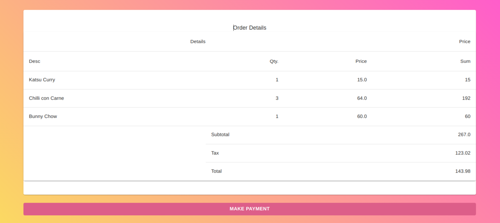

# AGNOS CAFE

## Problem Statement - A day at a coffee shop!

- A customer visits a coffee shop that sells a bunch of items (e.g. beverages, sandwiches, etc.).
- Items have varying tax rates and some are free or offered at a discount when ordered with another item.
- The customer is made aware of the order total and once he pays for it, he can wait until notified of the order completion.
- You are required to describe a program with a set of interfaces that models the above problem at hand. You need to design the DB and backend architecture and implement it. Front-end is not mandatory but your endpoints should be reachable through Postman (please attach postman collection).
- Users should be able to see the list of available items, User should be able to order them and should get a notification after a fixed amount of time that their order is ready.
- Unit test cases are not mandatory.
- Tech Stack - Ruby on Rails. You can also show us your front-end skills in some JS technologies (React/Angular, etc) or Bootstrap, or plain Html/JS.

## Assumption

## Pre-requisite

1. Ruby - `v3.0.1`
2. Rails - `7.0.4`
3. Node - `v14.16.0`
4. Database - `Postgresql`

## How to setup project

### Setup backend

- Go to backend folder - `cd backend`
- Install bundle - `bundle install`
- Setup DB - `rails db:setup`
- Run rails server - `rails s`

The server will start at `http://localhost:3000`

### Setup frontend

- Go to frontend folder - `cd frontend`
- Install packages - `npm install`
- add `.env.local` file and add below details in the file
```
NEXT_PUBLIC_BASE_URL=http://localhost:3000
```
- Run server - `npm run dev`

The app will start at `http://localhost:3001`

Please open `http://localhost:3001` on the browser

## DB Design


## Swagger doc

[Swagger doc](./Agnos%20Cafe%20Swagger%20Collection.json)

## Current implemented system design


## System Design


## Screenshot of application

1. Login screens
   1. User is required to add Name and Phone number


1. Product list screen
   1. User can view and select multiple products
   2. Products have title, description and price
   3. CTA give to proceed and place the order


1. Order listing screen
   1. User can view selected products and check the calculation before making payment
   2. CTA give to proceed and make payment



1. Thank you screen
   1. User is shown thank you messages with the payment transaction ID
   2. CTA give for user to place another order


